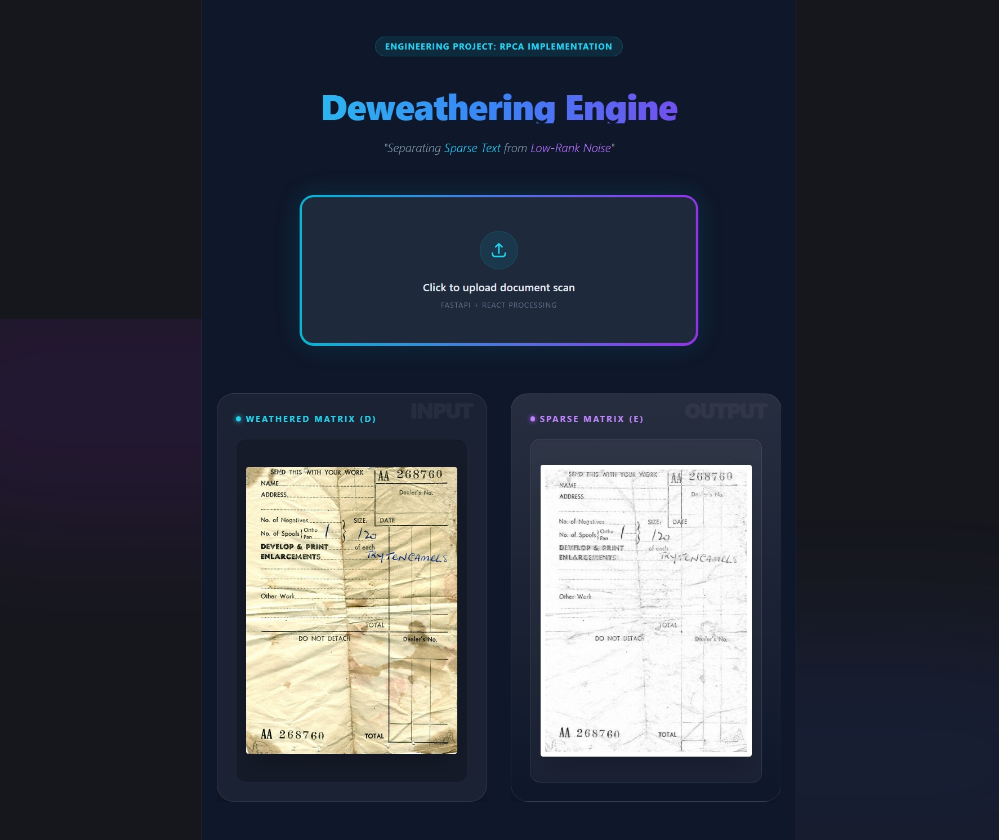

# 📄 Document Deweathering Engine
[](https://deweathering-engine.vercel.app)


An unsupervised machine learning application designed to restore weathered, stained, or degraded documents. This project implements **Robust Principal Component Analysis (RPCA)** using the **Inexact Augmented Lagrange Multiplier (IALM)** algorithm with **Adaptive Regularization**.

## 🚀 The Core Engineering
Most restoration tools use static filters. This engine uses **Matrix Optimization** to solve document degradation. It treats an image as a matrix $D$ and decomposes it into:
- **Low-Rank Matrix (A):** The background interference, illumination, and stains.
- **Sparse Matrix (E):** The sharp text and handwriting.

The system solves the following optimization problem:
$$\min_{A,E} \|A\|_* + \lambda \|E\|_1 \quad \text{s.t.} \quad A + E = D$$

### 🧠 New: Adaptive Regularization
Unlike standard RPCA implementations, this engine uses a **Dynamic Heuristic** to adjust the regularization parameter $\lambda$ based on the input's noise density.
- **Noise Analysis:** The backend calculates the standard deviation ($\sigma$) of the input matrix.
- **Scaling:** It dynamically scales the penalty parameter $k$ between **0.4** and **0.8**.
- **Impact:** This ensures that clean documents aren't "over-processed" while heavily stained documents receive aggressive restoration.

## 🛠️ Technical Stack
- **Backend:** Python, FastAPI, NumPy, OpenCV (Adaptive SVD-based optimization)
- **Frontend:** React, Vite, Tailwind CSS (Glassmorphism UI)
- **Version Control:** Git & GitHub

## 📂 Project Structure
- `/backend`: The Python math engine and FastAPI server.
- `/frontend`: The React web application interface.
- `/assets`: Project screenshots and demo media.

## ⚙️ How to Run
1. **Start the Backend:**
   ```bash
   cd backend
   uvicorn main:app --reload